```mermaid
sequenceDiagram
    participant Client as 클라이언트
    participant ProductSystem as 상품

    Client->>ProductSystem: 1. 상품 조회 요청(productId)
    activate ProductSystem
    Note over ProductSystem: 상품 유효성 검증

    alt 검증 성공
        ProductSystem->>Client: 2. 상품 정보 응답(id,이름,가격,잔여수량)
    else 검증 실패
        ProductSystem->>Client: 2. 에러 응답
    end
    deactivate ProductSystem
```

```mermaid
sequenceDiagram
    participant Customer as 클라이언트
    participant OrderSystem as 주문
    participant PaymentSystem as 결제
    participant DataSystem as 데이터플랫폼

    Customer->>OrderSystem: 1. 주문 요청(userId, products, couponId)
    activate OrderSystem
    Note over OrderSystem: 상품/재고/쿠폰 유효성 검증

    alt 주문 유효성 검증 성공
        OrderSystem->>PaymentSystem: 2. 결제 요청
        activate PaymentSystem

        alt 결제 성공
            PaymentSystem->>OrderSystem: 3. 결제 성공 응답
            OrderSystem->>Customer: 4. 주문 완료 알림
            Note over OrderSystem,DataSystem: 비동기 데이터 처리
            OrderSystem-->>DataSystem: 5. 주문/결제 데이터 저장(PAID)
        else 결제 실패
            PaymentSystem->>OrderSystem: 3. 결제 실패 응답
            OrderSystem->>Customer: 4. 주문 실패 알림
        end
        deactivate PaymentSystem
    else 주문 유효성 검증 실패
        OrderSystem->>Customer: 2. 주문 실패 알림(재고 부족 등)
    end
    deactivate OrderSystem
```

```mermaid
sequenceDiagram
    participant Customer as 클라이언트
    participant OrderSystem as 주문
    participant ProductSystem as 상품
    participant CouponSystem as 쿠폰

    Customer->>OrderSystem: 1. 주문 생성 요청(userId, products, couponId)
    activate OrderSystem

    OrderSystem->>ProductSystem: 2. 상품 정보/재고 확인
    activate ProductSystem
    ProductSystem->>OrderSystem: 3. 상품/재고 확인 완료
    deactivate ProductSystem

    alt 재고 충분
        OrderSystem->>CouponSystem: 4. 쿠폰 유효성 검증
        activate CouponSystem
        alt 쿠폰 유효
            CouponSystem->>OrderSystem: 5. 할인 금액 계산 완료
            deactivate CouponSystem
            OrderSystem->>ProductSystem: 6. 재고 할당
            activate ProductSystem
            deactivate ProductSystem
            OrderSystem->>Customer: 7. 주문 생성 완료(CREATED, 할인적용가)
        else 쿠폰 무효
            CouponSystem->>OrderSystem: 5. 쿠폰 검증 실패
            OrderSystem->>Customer: 주문 생성 실패(쿠폰 오류)
        end
    else 재고 부족
        OrderSystem->>Customer: 주문 생성 실패(재고 부족)
    end
    deactivate OrderSystem
```

```mermaid
sequenceDiagram
    participant OrderSystem as 주문
    participant PaymentSystem as 결제
    participant DataSystem as 데이터플랫폼

    OrderSystem->>PaymentSystem: 1. 결제 요청(orderId)
    activate PaymentSystem
    Note over PaymentSystem: 사용자 잔액 확인

    alt 잔액 충분
        Note over PaymentSystem: 잔액 차감 처리
        PaymentSystem->>OrderSystem: 2a. 결제 성공
        activate OrderSystem
        Note over OrderSystem,DataSystem: 비동기 데이터 처리
        OrderSystem-->>DataSystem: 3. 주문 데이터 저장(PAID)
        deactivate OrderSystem
    else 잔액 부족
        PaymentSystem->>OrderSystem: 2b. 결제 실패
        activate OrderSystem
        OrderSystem-->>DataSystem: 3. 주문 상태 업데이트(PAYMENT_FAILED)
        deactivate OrderSystem
    end
    deactivate PaymentSystem
```

```mermaid
sequenceDiagram
    participant Client as 클라이언트
    participant CouponSystem as 쿠폰

    Client->>CouponSystem: 1. 쿠폰 발급 요청(userId, couponId)
    activate CouponSystem
    Note over CouponSystem: Lock 획득 및 유효성 검증<br/>(사용자/쿠폰/수량)

    alt 검증 성공
        Note over CouponSystem: 쿠폰 발급 처리
        CouponSystem->>Client: 2a. 발급 성공 응답
    else 검증 실패
        CouponSystem->>Client: 2b. 발급 실패 응답
    end
    deactivate CouponSystem
```

```mermaid
sequenceDiagram
    participant Client as 클라이언트
    participant CouponSystem as 쿠폰

    Client->>CouponSystem: 1. 쿠폰 목록 조회 요청(userId)
    activate CouponSystem
    Note over CouponSystem: 사용자 유효성 검증

    alt 사용자 유효
        CouponSystem->>Client: 2. 쿠폰 목록 반환(빈 리스트 or 쿠폰 리스트)
    else 사용자 없음
        CouponSystem->>Client: 2. 에러 응답
    end
    deactivate CouponSystem
```

# 이커머스 서비스

## 🗓️ 마일스톤
[Github 마일스톤 링크](https://github.com/users/ynyejn/projects/1)
## 🗺️ 시퀀스 다이어그램

```mermaid
sequenceDiagram
    participant Client as 클라이언트
    participant UserSystem as 사용자

    Client->>UserSystem: 1. 잔액 충전 요청(userId, amount)
    activate UserSystem
    Note over UserSystem: 사용자/금액 유효성 검증

    alt 검증 성공
        UserSystem->>Client: 2. 충전 성공 응답(잔액)
    else 검증 실패
        UserSystem->>Client: 2. 에러 응답
    end
    deactivate UserSystem
```

<details>
<summary>잔액 충전 API</summary>
<h2>잔액 충전 시퀀스 다이어그램</h2>



</details>

<details>
<summary>잔액 조회 API</summary>
<h2>잔액 조회 시퀀스 다이어그램</h2>


</details>

<details>
<summary>상품 조회 API</summary>
<h2>상품 조회 시퀀스 다이어그램</h2>



</details>

<details>
<summary>주문/결제 API</summary>
<h2>주문/결제 통합 시퀀스 다이어그램</h2>



<details>
<summary>a.주문 상세</summary>
<h2>a.주문 상세 시퀀스 다이어그램</h2>



</details>
<details>
<summary>b.결제 상세</summary>
<h2>b.결제 상세 시퀀스 다이어그램</h2>



</details>


</details>

<details>
<summary>선착순 쿠폰 발급 API</summary>
<h2>선착순 쿠폰 발급 시퀀스 다이어그램</h2>



</details>

<details>
<summary>보유 쿠폰 목록 조회 API</summary>
<h2>보유 쿠폰 목록 조회 시퀀스 다이어그램</h2>


</details>
<details>
<summary>인기 상품 조회 API</summary>
<h2>인기 상품 조회 시퀀스 다이어그램</h2>


    
</details>

```mermaid
sequenceDiagram
    participant Client as 클라이언트
    participant ProductSystem as 상품
    participant BatchSystem as 배치
    participant OrderSystem as 주문

    Note over BatchSystem,OrderSystem: 매일 새벽 3시 배치 실행
    BatchSystem->>OrderSystem: 1. 최근 3일 주문 데이터 조회
    activate BatchSystem
    OrderSystem->>BatchSystem: 2. 주문 데이터 반환
    Note over BatchSystem: 상위 5개 상품 집계
    BatchSystem->>ProductSystem: 3. 인기 상품 데이터 저장
    deactivate BatchSystem

    Note right of Client: API 호출 시점
    Client->>ProductSystem: 4. 인기 상품 목록 요청
    activate ProductSystem
    Note over ProductSystem: 저장된 인기 상품<br/>데이터 조회
    ProductSystem->>Client: 5. 인기 상품 목록 반환
    deactivate ProductSystem
```

## 🖇️ ERD


## 📝️ API 명세
<details>
<summary>잔액 충전 API</summary>
<br>

</details>
<details>
<summary>잔액 조회 API</summary>
<br>

</details>
<details>
<summary>상품 조회 API</summary>
<br>

</details>
<details>
<summary>주문/결제 API</summary>
<br>

</details>
<details>
<summary>결제 API</summary>
<br>

</details>
<details>
<summary>선착순 쿠폰 발급 API</summary>
<br>

</details>
<details>
<summary>보유 쿠폰 목록 조회 API</summary>
<br>

</details>
<details>
<summary>인기 상품 조회 API</summary>
<br>

</details>
<br><br>

## Getting Started

### Prerequisites

#### Running Docker Containers

`local` profile 로 실행하기 위하여 인프라가 설정되어 있는 Docker 컨테이너를 실행해주셔야 합니다.

```bash
docker-compose up -d
```