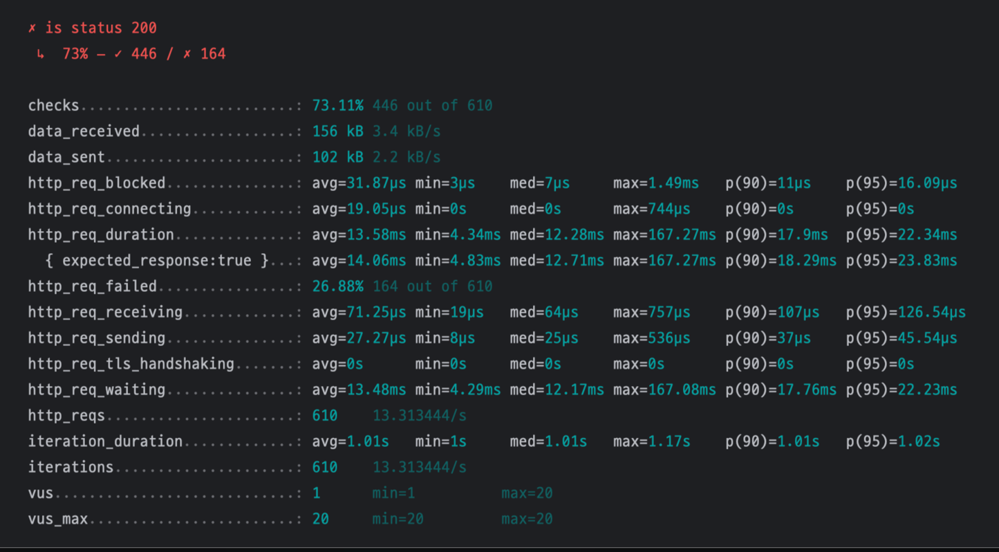
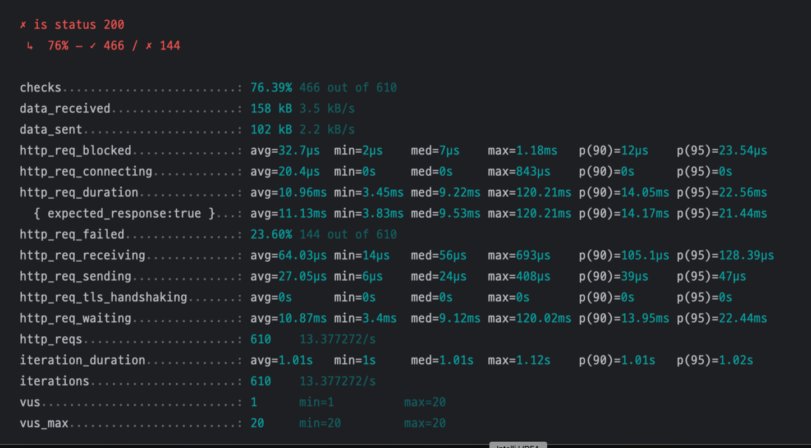
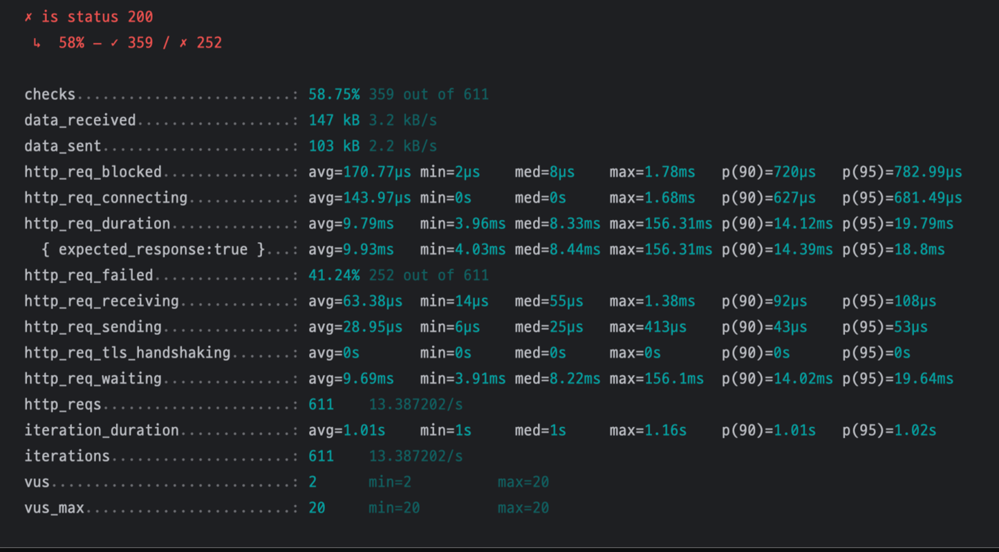

# 동시성 이슈 분석 및 제어 방식 보고서

## 1. 동시성 이슈 별 분석

### A. 재고관리 (비관적 락)
- **문제 상황**:  
  여러 사용자가 동시에 동일 상품 재고를 차감할 경우 데이터 불일치가 발생할 수 있습니다.
- **해결 방식**:  
  데이터베이스에서 `SELECT ... FOR UPDATE`를 사용하는 비관적 락을 적용하여 재고 차감 시 동시 접근을 제어합니다.
- **선정 이유**:
    - 재고 수량은 실물과 직접 연결된 데이터로, 오차가 발생하면 실제 비즈니스 손실로 이어질 수 있기 때문에 데이터 일관성이 무엇보다 중요하다고 판단했습니다. 이를 위해 분산락과 비관락을 모두 고려했으나, 현재 구조에서는 OrderFacade에서 ProductService를 호출하며 상위 트랜잭션이 존재하고 있습니다. 이러한 구조에서는 분산락보다 비관락이 더 적합하다고 판단하였고, 따라서 비관락을 선택하여 구현했습니다. 비관락은 DB 수준에서 직접 락을 걸기 때문에 트랜잭션 범위와 락의 범위가 일치하여 데이터 정합성을 보다 안전하게 보장할 수 있습니다.

---

### B. 쿠폰발급 (분산락)
- **문제 상황**:  
  동시에 다수의 사용자가 쿠폰을 발급받을 경우 발급 가능한 수량을 초과할 수 있습니다.
- **해결 방식**:  
  Redis를 활용한 분산락을 적용하여 특정 쿠폰 ID에 대해 락을 걸고, 발급 후 락을 해제합니다.
- **선정 이유**:
    - 쿠폰 발급에도 재고 관리처럼 데이터 정합성이 중요합니다. 하지만 쿠폰 발급은 상위 트랜잭션이 존재하지 않고 단독으로 실행되는 프로세스이고 특히 선착순 쿠폰의 경우 짧은 시간에 수많은 사용자가 동시에 요청을 보내는 경우가 많아 DB 트랜잭션에 과도한 부하가 걸릴 수 있기 때문에 대용량 요청 시 트랜잭션의 부하를 줄여줄 수 있는 분산락을 사용하여 동시성을 제어하였습니다.

---

### C. 포인트조회 (낙관적 락)
- **문제 상황**:  
  동일 사용자가 동시에 포인트를 사용하거나 충전하려고 할 때 데이터 충돌이 발생할 수 있습니다.
- **해결 방식**:  
  JPA의 `@Version` 어노테이션을 활용하여 버전 기반 충돌 감지를 적용합니다. 충돌이 발생하면 재시도를 통해 해결합니다.
- **선정이유**:
    - 포인트 관리에서는 다른 사용자의 동시성은 신경 쓸 필요가 없고 같은 사용자의 포인트 사용과 충전만 관리하면 되기 때문에 낙관적 락을 선택하였습니다. 사용자가 따닥 클릭으로 인해 중복으로 포인트 차감 요청이 발생한 경우 첫번째 트랜잭션만 성공하고 나머지는 실패해도 문제가 없기 때문에 낙관적 락을 사용하여 성능을 향상시킬 수 있습니다. 낙관적 락은 version 필드만으로 충돌을 감지할 수 있어 구현도 간단하고, 동시 요청이 많지 않은 상황에서는 성능도 좋습니다.

---

## 3. 성능 테스트 결과

### 테스트 환경
| 구분 | 내용 |
|------|------|
| 테스트 기간 | 총 45초 (램프업 15초, 안정화 15초, 램프다운 15초) |
| 가상 사용자 수 | 최대 20명 (0→20→0명) |
| 요청 간격 | 1초 |
| 테스트 방식 | 무작위 사용자 ID (1-1000)로 쿠폰 발급 요청 |
| 성공 판단 기준 | HTTP 상태코드 200 |
| 모니터링 항목 | 응답시간, 성공률, TPS, 에러율 |

### 동시성 제어 방식
- **분산락**:
- 
- **비관적 락**:
- 
- **낙관적 락**:
- 

### 테스트 결과 주요 지표

| 지표 | 분산락 | 비관적 락 | 낙관적 락 |
|------|---------|-----------|-----------|
| 성공률 | 73.11% | 76.39% | 58.75% |
| 평균 응답시간 | 13.58ms | 10.96ms | 9.79ms |
| 최대 응답시간 | 167.27ms | 120.21ms | 156.31ms |
| TPS | 13.31 | 13.37 | 13.38 |
| 실패율 | 26.88% | 23.60% | 41.24% |
| p95 응답시간 | 22.34ms | 22.56ms | 19.79ms |

### 분석

- **성공률**:
    - 성공률 측면에서 가장 큰 차이가 났습니다. 비관적 락이 76.39%로 가장 높은 성공률을 보였고, 분산락이 73.11%, 반면 낙관적 락은 58.75%로 상대적으로 낮은 성공률을 보였습니다. 비관적 락과 분산락은 동시성 제어를 먼저 수행하여 충돌을 방지하지만 낙관적 락은 충돌 발생 시 실패 처리하는 방식이기 때문입니다.
- **응답시간**:
    - 평균 응답 시간은 낙관적 락이 9.79ms로 가장 빨랐고, 비관적 락이 10.96ms, 분산락이 13.58ms을 기록했습니다. 낙관적 락은 락 획득을 위한 대기 시간이 없어 가장 빠르고, 비관적 락은 DB 수준의 락 획득 시간이 필요하며, 분산락은 Redis와의 네트워크 통신 시간이 추가되기 때문에 이런 결과가 나타난 것으로 보입니다.
- **처리량**:
    - TPS 측면에서는 분산락이 13.31 을 기록했고, 낙관적 락과 비관적 락이 13.38,13.37을 기록했습니다. 분산락은 Redis와의 통신 시간이 추가되어 처리량이 낮아진 것으로 보입니다.

- **결론**:
    - 비관적 락은 높은 성공률과 안정적인 성능을 제공하지만 락 획득을 위한 대기 시간이 필요합니다. 분산락은 비관적 락과 비슷한 수준의 안정성을 제공하면서도 분산 환경에서의 확장성을 제공하지만, 추가적인 네트워크 통신으로 인한 지연이 발생합니다. 낙관적 락은 가장 빠른 응답 시간을 보여주지만 높은 실패율을 감수해야 합니다.
- **대용량 요청시 예상**:
    - 분산락: 네트워크 지연은 증가하지만, Redis의 빠른 처리 속도로 인해 처리량 감소가 가장 적게 일어날 것으로 예상됩니다.
    - 비관적 락: DB 락 획득을 위한 대기 시간이 크게 증가하여, 처리량이 크게 감소할 것으로 예상됩니다.
    - 낙관적 락: 충돌 발생 빈도가 매우 높아져 대부분의 트랜잭션이 실패하고, 재시도로 인한 DB 부하가 증가할 것으로 예상됩니다.
---

## 4. 결론
- **추가 개선 포인트**:
    - 비관적 락의 경우 트랜잭션 길이를 최소화하여 성능 최적화.
    - Redis TTL 설정 최적화로 분산락의 안정성 강화.
    - 분삭락 사용 시 Redis 장애 시에도 낙관락으로 보호할 수 있는 방안 검토.
    - 낙관적 락 충돌 시 재시도 로직을 최적화하여 성능 개선.